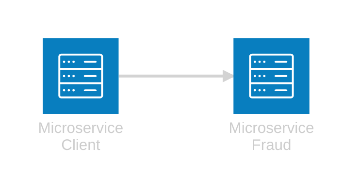

# Practica Microservicos

+ [Microservices Simple](microservices) - Microservices Client and Fraud, connected via http rest

```mermaid
---
config:
  theme: 'dark'
---
architecture-beta
    service client_service(server)[Microservice Client]
    service fraud_service(server)[Microservice Fraud]

    client_service:R --> L:fraud_service
```

