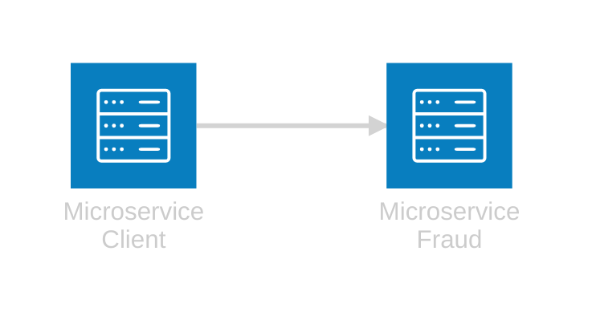
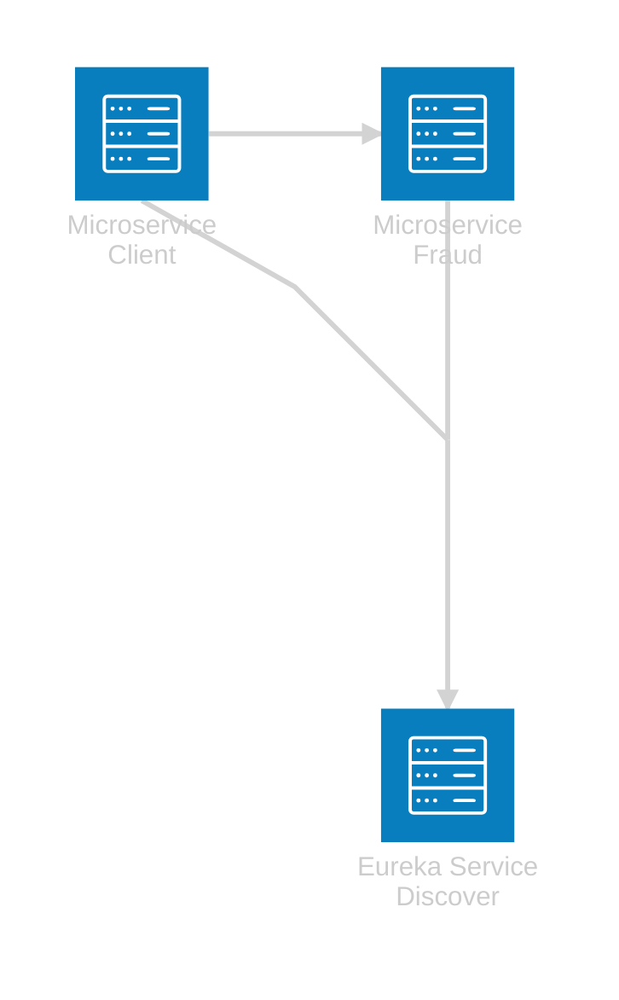

# Practica Microservicos

+ [Microservices Simple](microservices) - Microservices Client and Fraud, connected via http rest

+ [Microservices with Eureka Server Discover](microservices-with-eureka-service-discover) - Microservices with Eureka Server Discover

