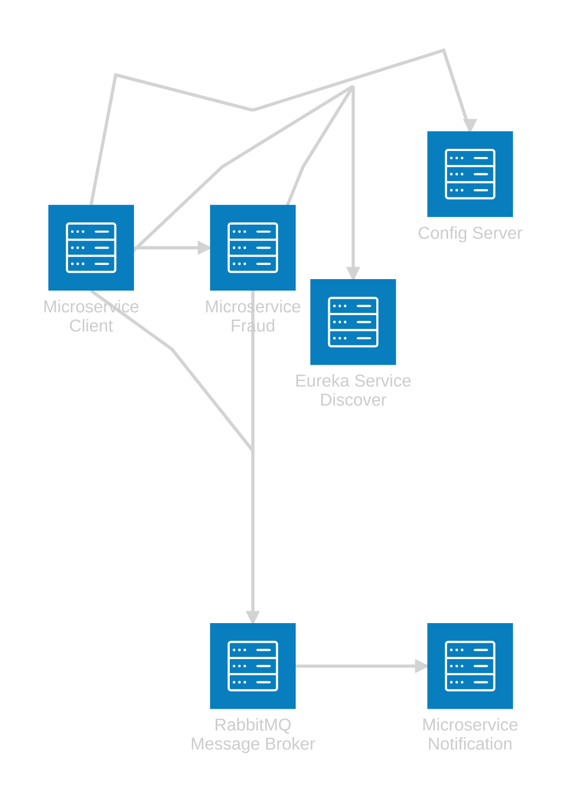

# Practical Microservices in spring cloud

+ [Microservices Simple](microservices) - Microservices Client and Fraud, connected via http rest

+ [Microservices with Eureka Server Discover](microservices-with-eureka-service-discover) - Microservices with Eureka Server Discover

+ [Microservices with Menssage Broker](microservices-with-message-queue) - Microservices with Kafka Message Broker and Microservice Notification 

+ [Microservices with Menssage Broker RabbitMQ](microservices-with-message-queue-in-rabbitmq) - Microservices with RabbitMQ Message Broker

+ [Microservices with Config Server](microservices-with-config-server) - Microservices with Config Server

  
+ Spring Cloud API Gateway IN PROGRESS
+ Spring Cloud Zookeeper IN PROGRESS
